## Links

- **Repositório:** <https://github.com/sandyLohran/Tech-Challenge-Fase-1-Diagn-stico-de-C-ncer-de-Mama-com-ML>
- **Vídeo de demonstração:** *[inserir link do YouTube/Vimeo]*
- **Dataset:** Breast Cancer Wisconsin (Diagnostic) — vem do `scikit-learn`; versão no Kaggle: <https://www.kaggle.com/datasets/uciml/breast-cancer-wisconsin-data>

O repositório tem o código completo, o `README.md` com instruções, o `Dockerfile`, os 4 notebooks já executados, o modelo treinado e os testes.

## 1. Problema e dataset

A ideia é um sistema de apoio ao diagnóstico: classificar um tumor de mama como **maligno** ou **benigno** a partir de medidas de exame. Importante deixar claro: isso **não substitui o médico** — serve pra triagem e pra priorizar casos. A API devolve um disclaimer nesse sentido em toda resposta.

Dataset: 569 exames, 30 features numéricas (média, erro padrão e "pior valor" de 10 medidas — raio, textura, perímetro, área, concavidade etc.). Sem valores nulos. Classes: ~63% benigno, ~37% maligno. O sklearn entrega `0 = maligno`; **inverti pra `1 = maligno`** pra classe positiva ser a doença (aí recall fica natural de ler).

## 2. Análise exploratória

Notebook: `01_eda.ipynb`.

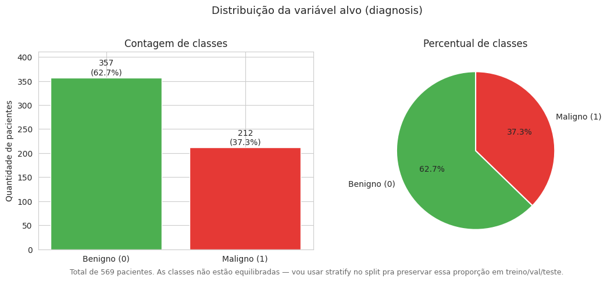

357 benignos (62,7%) e 212 malignos (37,3%). Não é desbalanceamento grave, mas anotei pra usar `stratify` no split.

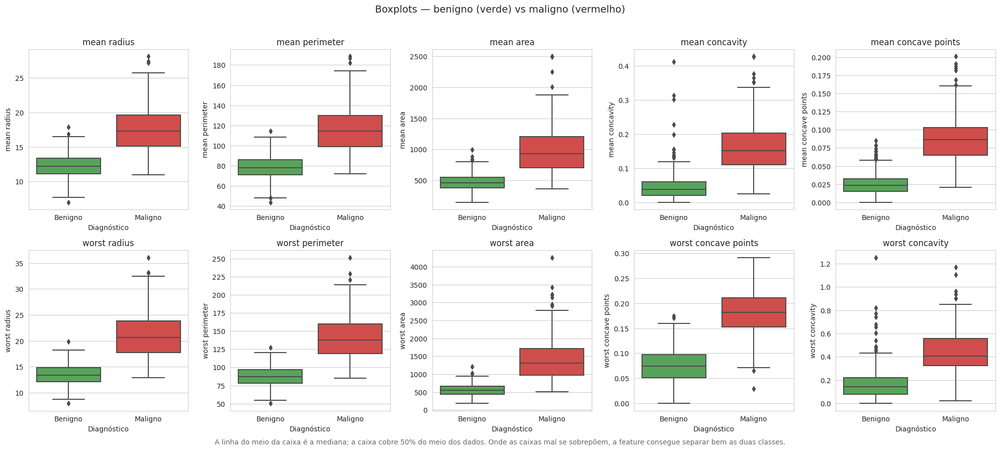

Tumores malignos tendem a ser maiores e mais irregulares — em `worst concave points`, `worst perimeter`, `mean concavity` as caixas das duas classes mal se sobrepõem. Onde separam bem, a feature ajuda o modelo. A classe maligna também tem mais outliers (decidi não removê-los — parecem ser parte do sinal).

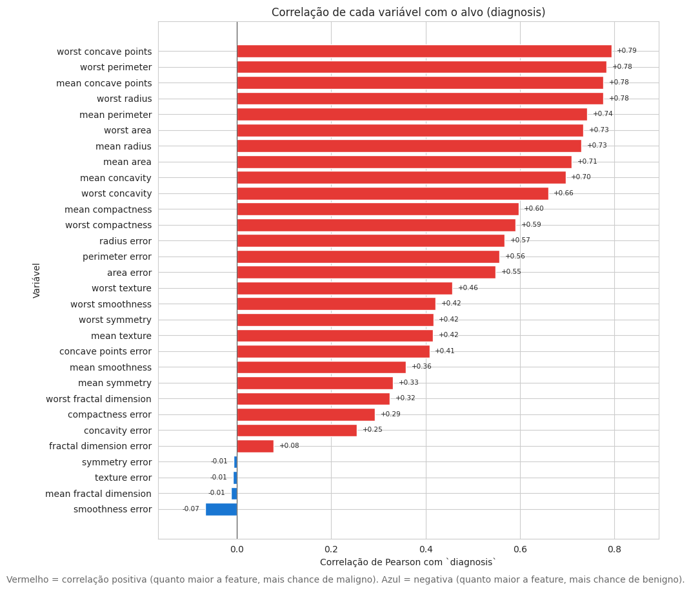

As features de tamanho/formato (`worst concave points`, `worst perimeter`, `worst radius`...) são as mais correlacionadas com o diagnóstico, várias acima de 0,7.

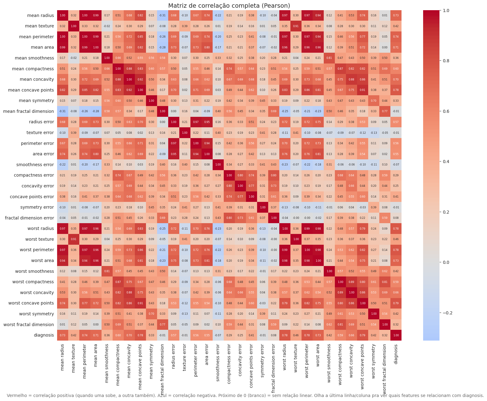

Tem grupos de features muito parecidas entre si (`mean radius`, `radius error`, `worst radius` medem quase a mesma coisa) — multicolinearidade. Pode atrapalhar a Regressão Logística; árvores lidam melhor. Não removi features manualmente.

**Resumo:** usar `stratify`; padronizar (escalas vão de milhares a 0,1); manter outliers; cuidar da multicolinearidade.

## 3. Pré-processamento

Notebook: `02_preprocessing.ipynb`. Código: `src/preprocessing.py`.

- **Divisão estratificada em 3 conjuntos:** treino (~70%, 398), validação (~10%, 57) e teste (~20%, 114). `random_state=42`, reprodutível.
- **Pipeline do scikit-learn:** `SimpleImputer` → `StandardScaler` → modelo. Vantagem: ao salvar o `.pkl`, o scaler vai junto — na API não tem como esquecer de padronizar. E o scaler é fitado só no treino, então não há vazamento.

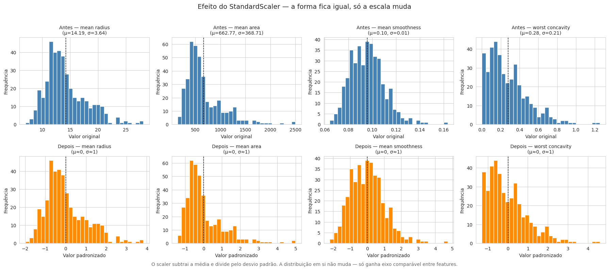

Depois do scaler cada feature fica com média perto de 0 e desvio perto de 1; a forma da distribuição não muda. Importante pro KNN (distância), pra Regressão Logística e pro SVM.

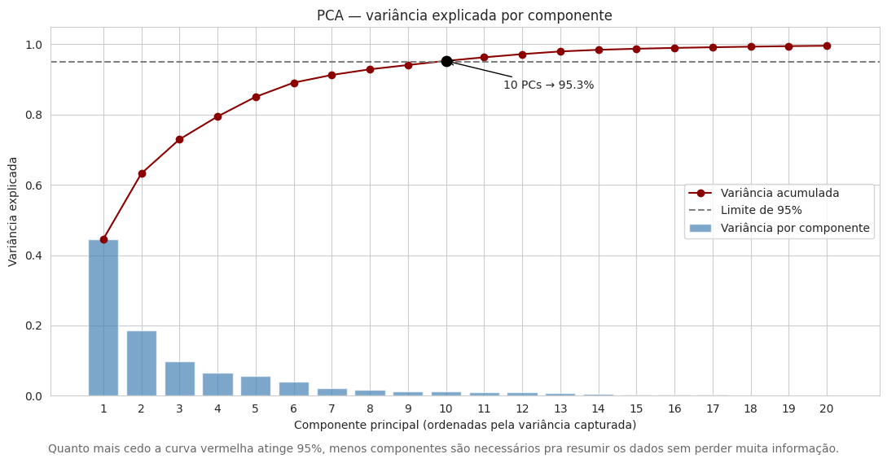

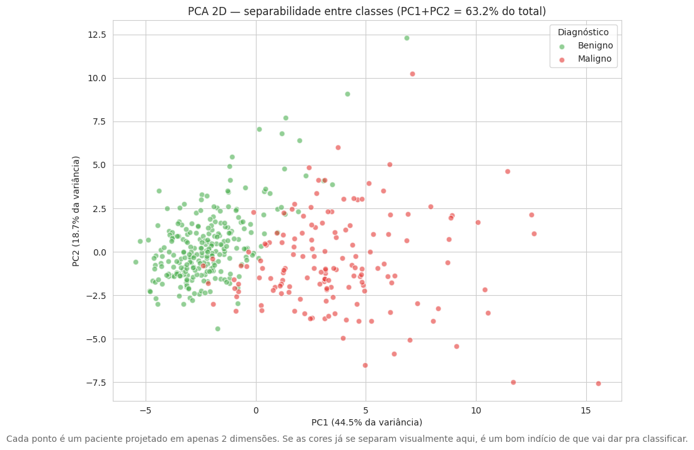

Brinquei com PCA só pra visualizar — com ~10 componentes explico ~95% da variância, e com 2 as classes já separam bem. **Não usei PCA no modelo final** porque destrói a interpretabilidade (não dá pra explicar pro médico o que é "componente principal 3").

## 4. Modelagem

Notebook: `03_models.ipynb`. Código: `src/models.py`. Treinei 5 modelos de perfis diferentes:

| Modelo | Por quê |
|---|---|
| Regressão Logística | Simples, interpretável (coeficientes = peso de cada feature). |
| KNN (k=5) | Básico, ajuda a validar o pré-processamento. |
| SVM (RBF) | Costuma ir bem com muitas features. |
| Random Forest (100 árvores) | Robusto, lida bem com multicolinearidade. |
| Decision Tree (prof. 5) | Baseline; tende a sobreajustar. |

**Métrica de seleção: recall** (da classe maligna). Motivo: num diagnóstico de câncer, o **falso negativo** (dizer "benigno" quando é "maligno") é o erro grave — a paciente vai pra casa achando que tá tudo bem. O **falso positivo** é ruim mas se resolve (exames a mais). Recall mede quantos dos casos malignos o modelo pegou — quero maximizar isso. Mas não fui só por recall: se marcasse "maligno" pra todo mundo, recall = 1,0 e o modelo seria inútil. Então também olhei precisão, F1 e ROC AUC. Recall é o critério de desempate. Avaliei com validação cruzada 5-fold estratificada e depois com o conjunto de teste.

## 5. Treinamento e avaliação

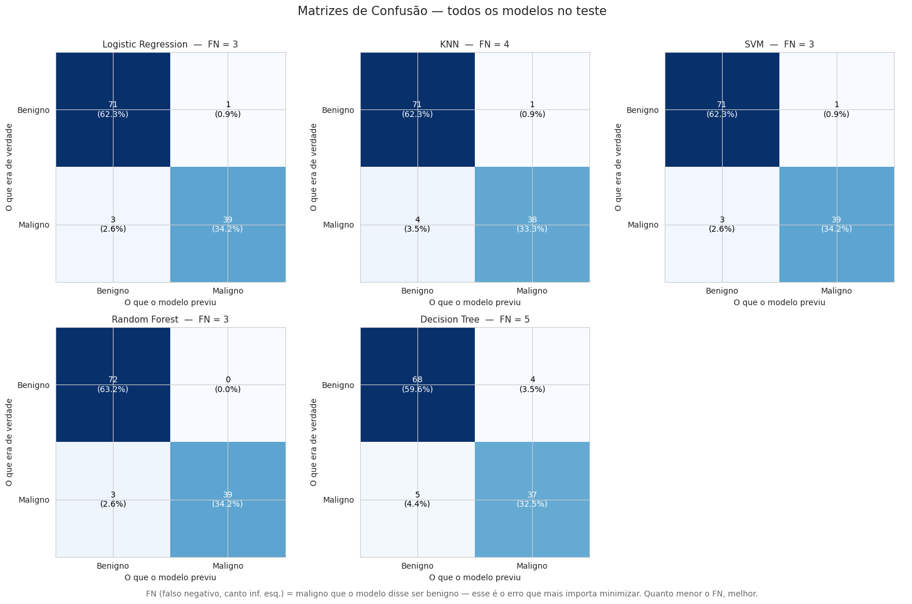

Cada célula traz o valor absoluto e o %, e o título destaca o FN (falso negativo). Regressão Logística, SVM e Random Forest empataram com poucos FN; Decision Tree foi o pior.

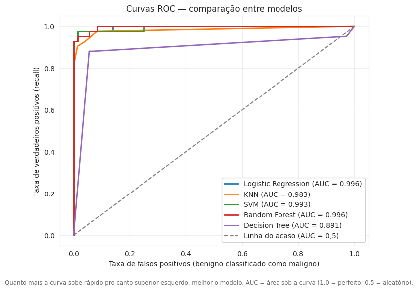

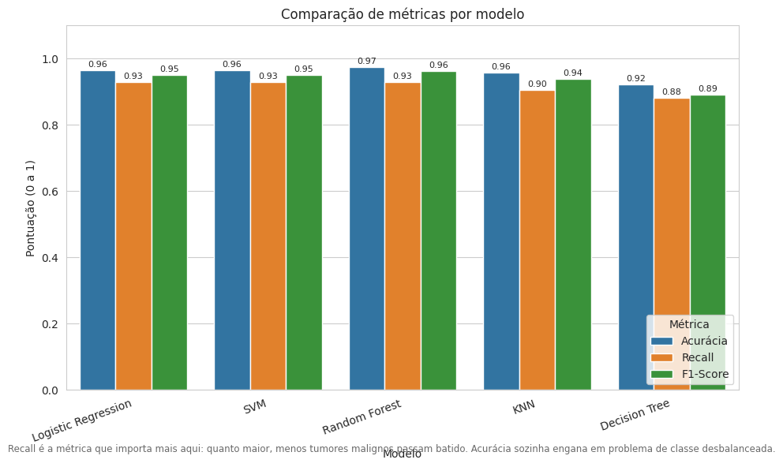

**Modelo escolhido: Regressão Logística** — empate técnico no topo, desempatei pela interpretabilidade. Métricas no teste:

| Métrica | Valor |
|---|---|
| Accuracy | 96,49% |
| Precision | 97,50% |
| Recall | 92,86% |
| F1-score | 95,12% |
| ROC AUC | 99,60% |

Resultados de todos os modelos ficam em `models/training_results.json`.

## 6. Explicabilidade

Notebook: `04_evaluation.ipynb`. Código: `src/explainability.py`. Usei feature importance e SHAP.

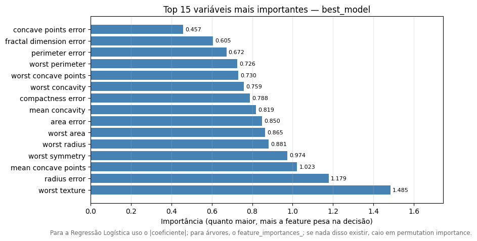

Pra Regressão Logística uso o |coeficiente|. As features de tamanho/formato dominam — bate com a EDA.

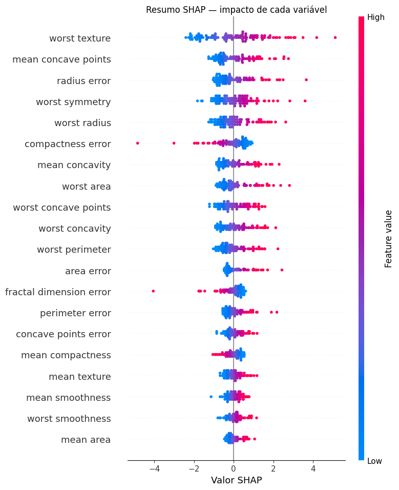

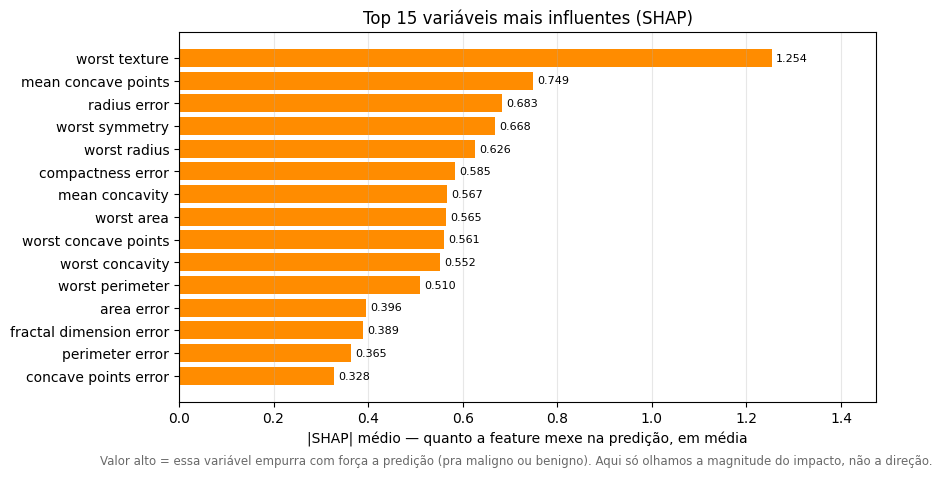

O SHAP mostra, pra cada feature e cada paciente, quanto ela empurrou a predição pra um lado. O summary dá a visão geral; o bar, a magnitude média do impacto.

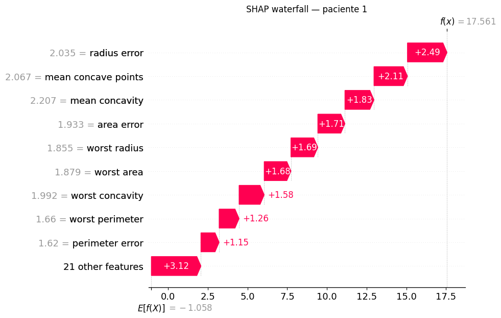

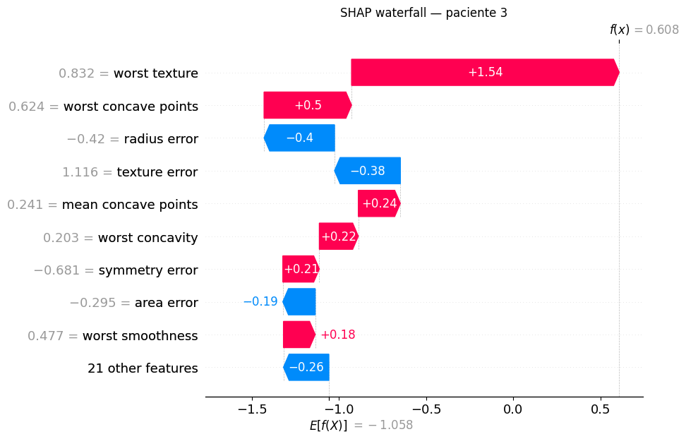

Pra um paciente específico dá pra ver exatamente quais medidas puxaram a decisão pra cima ou pra baixo. É o tipo de explicação que o médico precisaria ter junto com a predição.

*(Obs.: em alguns ambientes Windows o SHAP não importa por causa do Smart App Control; o notebook tem fallback que pula só as células de SHAP. No Docker funciona normal.)*

## 7. Discussão crítica

**Dá pra usar na prática? Como?** Como apoio, nunca como decisão final: o exame é feito → as 30 medidas extraídas → o modelo retorna predição + confiança → o médico olha isso junto com a imagem e o histórico → casos de alta probabilidade de maligno vão pra frente da fila. A palavra final é do médico — daí o disclaimer obrigatório na API.

**Os resultados foram bons demais** (todos acima de 90%) e isso me deixou desconfiado no começo. Esse dataset é considerado "fácil" — as features já foram bem escolhidas por especialistas. Em dados reais, mais bagunçados, esses números cairiam.

**Limitações:** dataset pequeno (569) e de uma fonte só; as 30 features já vêm prontas (alguém precisa extrair isso das imagens); sem dados demográficos; só diz "maligno/benigno", não diferencia tipos de tumor; e extrapola sem avisar se chegar um exame muito fora do que viu no treino.

**Melhoraria com mais tempo:** ensemble dos top-3 modelos; endpoint `/explain` na API com SHAP; validar em outro dataset; monitoramento em produção.

## 8. Código, API e Docker

```
tech-challenge-fase1/
  data/         CSV gerado do sklearn
  models/       best_model.pkl + training_results.json
  notebooks/    01_eda, 02_preprocessing, 03_models, 04_evaluation
  src/          data_loader, preprocessing, models, evaluate, explainability
  api/          API FastAPI (main, predictor, schemas)
  scripts/      train.py, evaluate.py
  tests/        14 testes com pytest
  Dockerfile + docker-compose.yml, requirements.txt, README.md
```

Separei o código reutilizável (`src/`) da forma como ele é usado (notebooks, API, CLI) — o mesmo módulo roda em produção.

**API (FastAPI):** `GET /` (health), `GET /model/info` (modelo, features, métricas), `POST /predict` (recebe os 30 valores crus do exame e devolve diagnóstico + confiança + nível de risco + disclaimer). Entrada validada pelo Pydantic. Docs interativas em `/docs`.

**Docker:** `docker compose up -d api` sobe a API; `docker compose run --rm api pytest tests -v` roda os 14 testes; `docker compose run --rm api python scripts/train.py` retreina. Dockerizei também porque o Windows que usei bloqueava o import de pydantic/shap (Smart App Control) — no container Linux funciona sem problema.

## Conclusão

Solução de ponta a ponta: EDA, pré-processamento com pipeline e split estratificado, comparação de 5 modelos com escolha justificada pelo recall, explicabilidade com feature importance e SHAP, API funcional com disclaimer, testes e Docker. O modelo é ferramenta de apoio — quem dá o diagnóstico final é o médico.

---

**Repositório:** <https://github.com/sandyLohran/Tech-Challenge-Fase-1-Diagn-stico-de-C-ncer-de-Mama-com-ML> · **Vídeo:** *[inserir link]*
